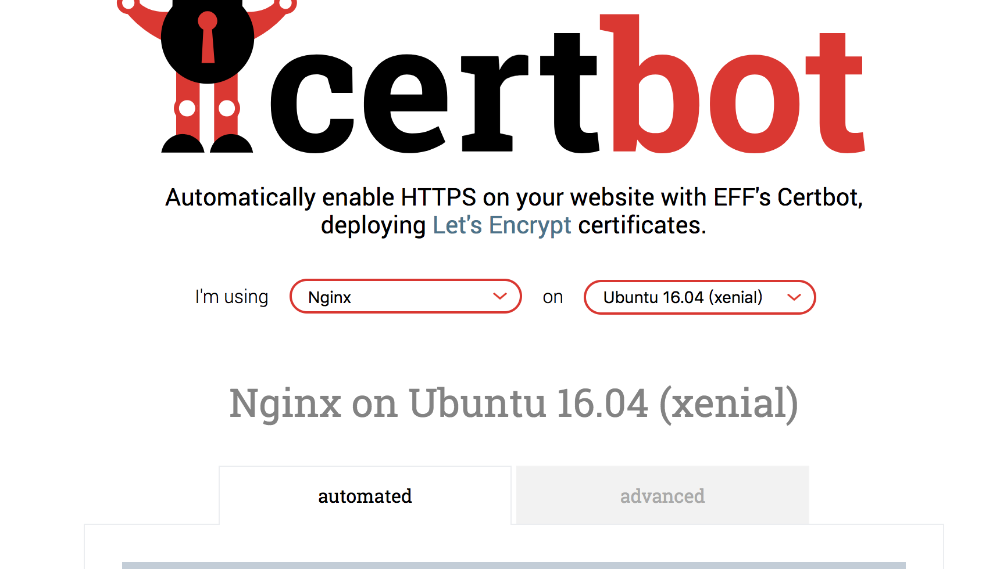
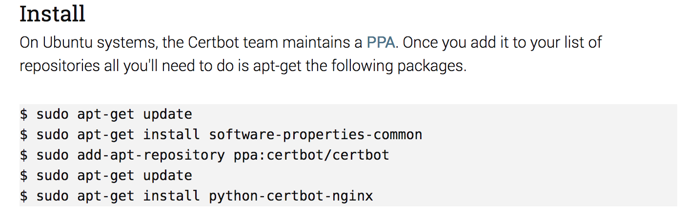

# dev-config
记录开发所用到的各种配置文件

## [prettier](./.prettierrc.yml)

prettier 是一个代码格式化工具。优势是考虑了代码的最大长度，对换行处理很好。而且可选的配置项很少，避免了团队里对代码风格的过多的争议。官方网站：https://prettier.io/

.prettierrc.yml：

```yaml
printWidth: 120
singleQuote: true
trailingComma: 'es5'
jsxBracketSameLine: true
```

将每列最大显示宽度 printWidth 设置为 120，这比较符合习惯，并且也看着更舒服。

对于前端，通常来说字符串会使用单引号，HTML 和 jsx 会使用双引号。

多行 object 字面量，最后一尾加上分号，这样看着更整齐。

jsx 的末尾中括号不另起一行，和 react 官方的配置相同。

语句末尾默认是加上分号的，在我观察了几个大型前端项目后，我决定不去改变它。我的习惯依然是不加分号，不过我会依赖自动格式化给语句添加分号。

## [gitignore](./.gitignore)

不需要添加到 git 版本库的文件，基于 create-react-app，做了一些自己的定制

```bash
# dependencies
/node_modules

# testing
/coverage

# production
/build

# misc
.DS_Store
.env.local
.env.development.local
.env.test.local
.env.production.local

# editor
/.vscode/settings.json
/.idea

npm-debug.log*
yarn-debug.log*
yarn-error.log*
```

## HTTPS

证书我们选用 Let's Encrypt。按照官方教程，推荐使用 [certbot](https://certbot.eff.org/) ACME client。certbot 可以自动进行证书的颁发和安装。

按照 certbot 的官网：https://certbot.eff.org/，选择服务器 nginx 和操作系统 ubuntu



执行以下命令



输入 `sudo certbot --nginx` 自动配置 nginx。

它将会对 nginx 新增如下类似的配置：

```bash
server {
  ...
  listen 443 ssl; # managed by Certbot
  ssl_certificate /etc/letsencrypt/live/bbs.chainx.org/fullchain.pem; # managed by Certbot
  ssl_certificate_key /etc/letsencrypt/live/bbs.chainx.org/privkey.pem; # managed by Certbot
  include /etc/letsencrypt/options-ssl-nginx.conf; # managed by Certbot
  ssl_dhparam /etc/letsencrypt/ssl-dhparams.pem; # managed by Certbot
}
```

## tslint

## ts config

## jest

## yarn

## babel

## postcss

## LICENSE

## package

## editorconfig

## chrome 扩展

## vs 扩展

## webpack

## vscode-chrome-debug
